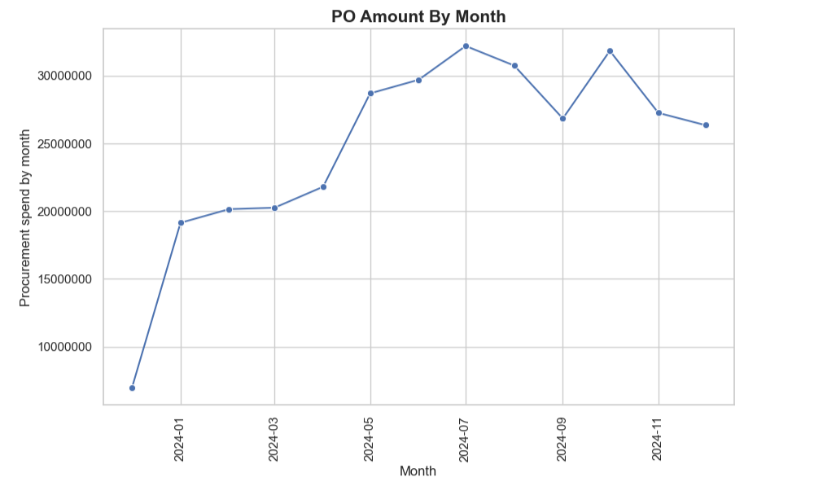
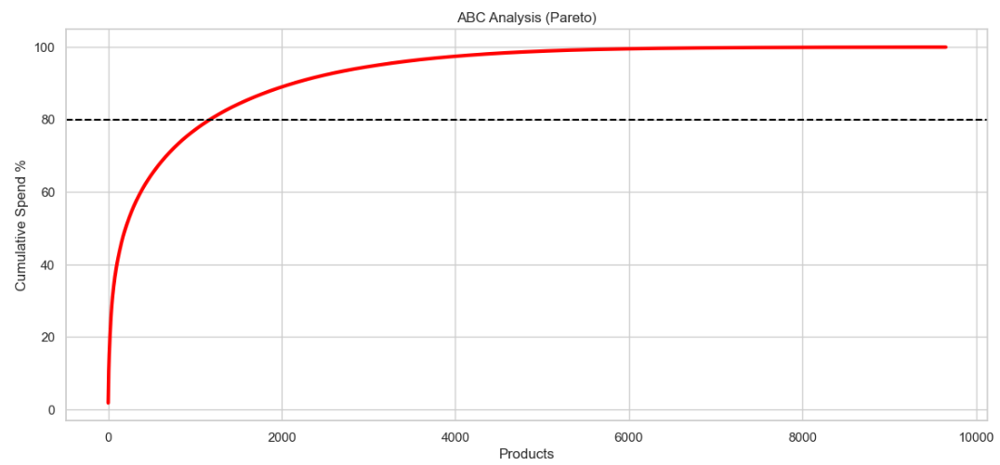
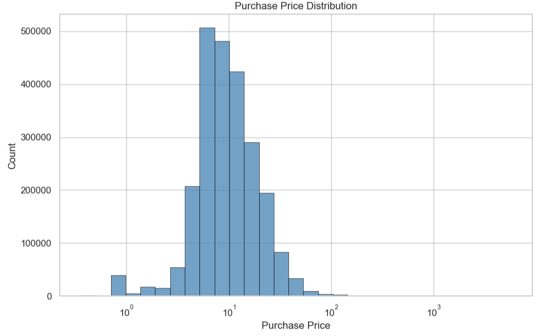
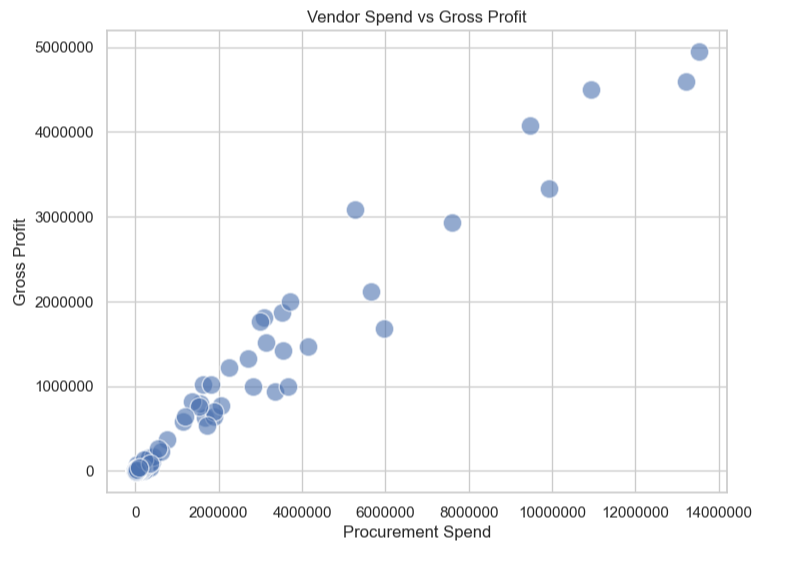
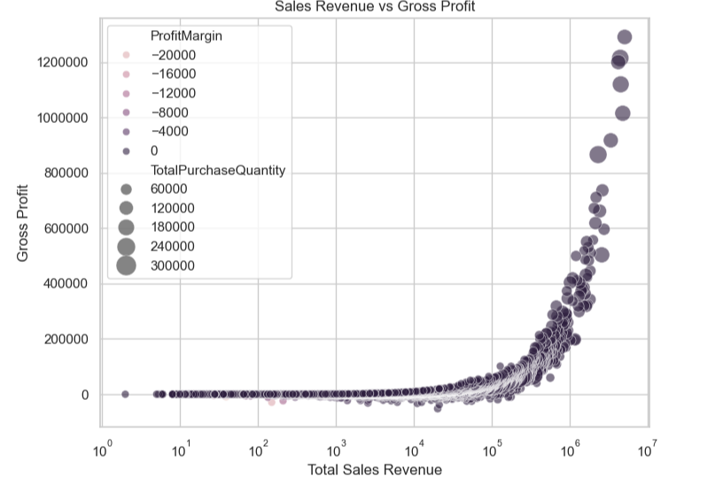

# Procurement & Vendor Performance Analysis

## Project Overview

This project analyzes procurement transactions and vendor performance data to uncover purchasing trends, supplier efficiency, inventory utilization, and profitability opportunities. Using Python and exploratory data analysis (EDA), the project transforms raw procurement and sales data into actionable business insights for procurement planning, supplier evaluation, and inventory optimization.

The project consists of two analytical notebooks:

- **Procurement Analysis**
- **Vendor Performance Analysis**

---

## Business Objectives

- Analyze monthly procurement spending trends.
- Evaluate supplier lead times and procurement efficiency.
- Perform ABC (Pareto) analysis to identify high-value products.
- Assess vendor profitability using procurement and sales KPIs.
- Analyze inventory efficiency using stock turnover and sales-to-purchase ratio.
- Identify loss-making and unsold products to support procurement optimization.

---

## Tools & Technologies

- Python
- Pandas
- NumPy
- Matplotlib
- Seaborn
- SQLite
- Jupyter Notebook

---

## Dataset

The original dataset was stored in a SQLite database (~2 GB). Due to GitHub file size limitations, the database is not included in this repository. The notebooks demonstrate the complete end-to-end analysis workflow using procurement and vendor transaction data. The analysis can be reproduced using datasets with the same schema.

---

## Repository Structure

```text
Procurement_Vendor_Performance_Analysis/
│
├── inventory.db
├── README.md
│
├── EDA_python/
│   ├── Procurement_analysis.ipynb
│   └── Vendor_performance_analysis.ipynb
│
└── Images/
    ├── ABC_analysis.png
    ├── Monthly_spend.png
    ├── Procurement_price_distribution.png
    ├── Sales_revenue_gross_profit.png
    └── Vendor_spend_gross_profit.png
```

---

# Procurement Analysis

This notebook focuses on procurement operations, purchasing trends, supplier lead times, and procurement efficiency.

### Key Analyses

- Monthly Procurement Spend Trend
- Procurement Lead Time Analysis
- Vendor Lead Time Comparison
- Purchase Price Distribution
- Purchase Order Analysis
- ABC (Pareto) Analysis
- Vendor Spend vs Lead Time

### Key Business Insights

- Procurement spending follows clear monthly fluctuations, indicating changing purchasing demand over time.
- Procurement spend is concentrated among a relatively small group of products, supporting ABC-based inventory prioritization.
- Supplier lead times vary across vendors, while procurement spend shows little relationship with delivery performance.
- Purchase prices and purchase order values exhibit right-skewed distributions, indicating a combination of routine purchases and high-value procurement events.

## Sample Visualizations

### Monthly Procurement Spend



---

### ABC (Pareto) Analysis



---

### Purchase Price Distribution



---

# Vendor Performance Analysis

This notebook evaluates supplier profitability, inventory efficiency, procurement ROI, and product performance using business KPIs.

### Key Analyses

- Vendor Gross Profit Analysis
- Procurement ROI
- Purchase Spend vs Profit Margin
- Sales Revenue vs Gross Profit
- Stock Turnover Analysis
- Sales-to-Purchase Ratio
- Loss-Making Products
- Unsold Inventory Analysis
- Vendor Performance KPIs

### Key Business Insights

- Vendor profitability varies significantly despite similar procurement investment.
- Higher sales revenue generally corresponds to higher gross profit, although products with similar sales levels exhibit different profitability.
- Inventory turnover alone does not determine profitability and should be evaluated alongside financial KPIs.
- Analysis of loss-making and unsold products highlights opportunities for procurement optimization and inventory reduction.

## Sample Visualizations

### Vendor Spend vs Gross Profit



---

### Sales Revenue vs Gross Profit



---

# Skills Demonstrated

- Exploratory Data Analysis (EDA)
- Data Cleaning & Transformation
- Procurement Analytics
- Vendor Performance Analysis
- Inventory Analytics
- Business KPI Analysis
- Data Visualization
- Business Insight Generation
- Python (Pandas, NumPy)
- SQL (SQLite)

---

# Future Enhancements

- Interactive Power BI Dashboard
- Procurement Demand Forecasting
- Vendor Performance Scoring Model
- Inventory Optimization Dashboard
